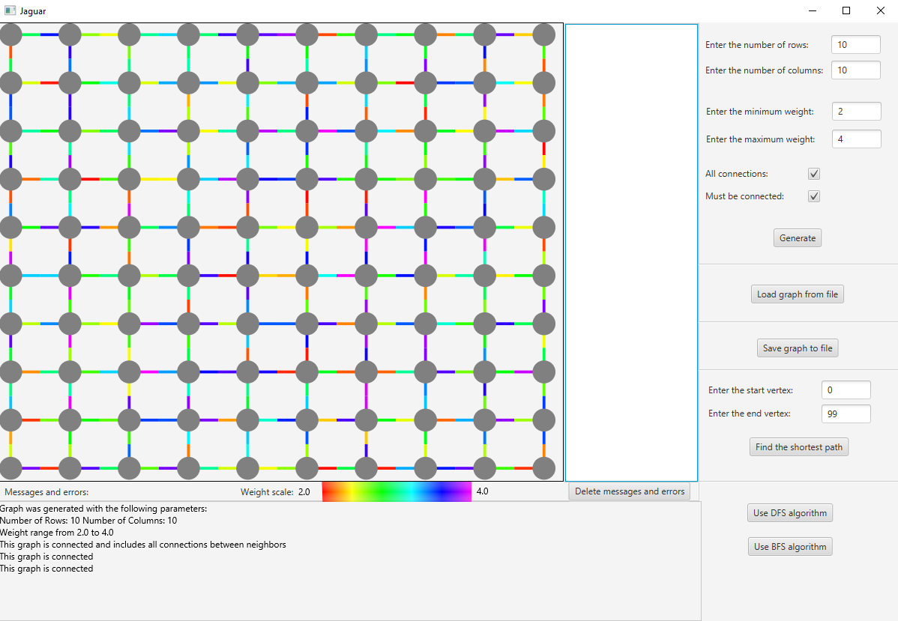
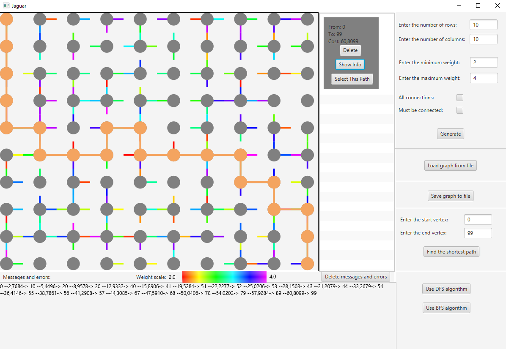

# GraphApp
This program allows the user to do different operations with graphs, which looks like "squared paper", are directed and weighted. We can generate graphs in three ways:  
a) graph that contains all edges between adjacent vertexes  
b) graph that is connected (this type of generation uses DFS algorithm which is made to check connections for each vertex, due to the time complexity we can generate only graph that contains up to 1000 vertexes)  
c) graph with randomly generated edges  
To generate graph we should mark options that we are interested in and specify number of columns, rows and range of weights and click the "Generate" button.
Generated graph we can save to the file and also we can load the graph from file.  
To check if graph is connected we can use:  
a) BFS algorithm - it is recommended when every path from one vertex to adjacent vertex is in both ways  
b) DFS algorithm - it is recommended in every other cases, but time complexity allows us to check if graph is connected when it has up to 1000 vertexes as mentioned above.    
We can also find the shortest path between two vertexes using Dijkstra algorithm and we can do that in two ways:  
a) type start and end vertex in the adequate field and press the button  
b) select two vertexes on the user interface by clicking on the middle of the each vertex  
Selected path should appear on the panel on the right side. We can find a few different paths from different vertexes and change the current path by clicking "Select This Path" button on the panel on the right side. We can also delete any path and check the details about the path.  

This application was written in Java language with JavaFX framework. To ensure compatibility I used a Maven tool, so to run this program it is needed to run "pom.xml" file.

# Example File
Example graph represantation:

<code>3 3 
      3 :2.703584  
      2 :3.928401  
      5 :2.630794  
      4 :3.870133  
      5 :2.413192  1 :3.320798  7 :3.015100  
      4 :3.368948  8 :3.437988  
      7 :2.609469  3 :2.335345  
      6 :2.728454  8 :2.369440 
</code> 

It means that the graph has 3 rows and 3 columns. Each line represents the neighbours of the current vertex (vertexes are listed one by one starting from the 0, ending at the last one). Here, vertex number 0 has exactly one neighbour which is vertex number 3 and
the cost of the route from vertex 0 to vertex 3 is 2.703584

# Screenshots
<ul>
  <li>Connected Graph</li>
   
    
  <li>Not Connected Graph With Dijkstra Usage</li>
   
    
</ul>
